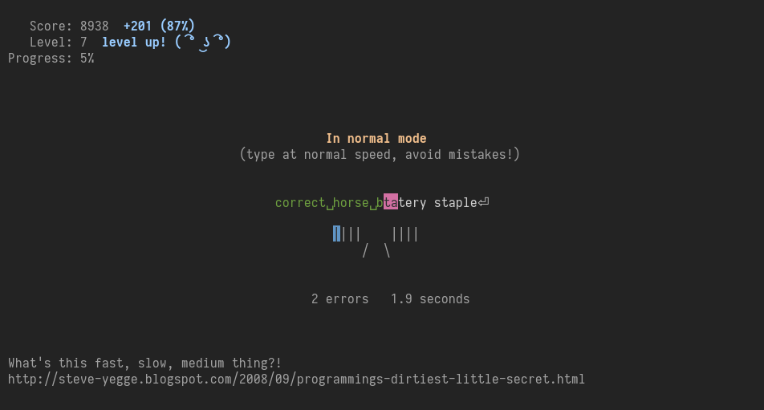

# Gotypist

A simple touch-typing tutor that follows [Steve Yegge's methodology](http://steve-yegge.blogspot.com/2008/09/programmings-dirtiest-little-secret.html) of going in fast, slow, and medium cycles.

The TL;DR of this methodology is that you make three passes for each phrase.

 * **Fast** - type as fast as you can without any attention to proper technique or correctness
 * **Slow** - use proper technique at all costs, go as slow as needed to achieve that
 * **Normal** - type at *target speed*, try to make no mistakes

Gotypist will score each pass accordingly: errors do not matter in the first pass, speed does not matter in the second pass, and both matter in the final pass. Check out `score.go` for details (which are subject to change).

This project is mainly motivated by trying out [termbox-go](https://github.com/nsf/termbox-go), but it is definitely ready for productive learning.

## Installation

    git clone git@github.com:pb-/gotypist.git "$GOPATH/src/github.com/pb-/gotypist"
    cd "$GOPATH/src/github.com/pb-/gotypist"
    make dep build

## Usage

    gotypist [-w FILE] [-s] [WORD]...

    -w FILE     Use this file as word list instead of /usr/share/dict/words
    -s          Run in demo mode to take a screenshot
    WORD...     Explicitly specify a phrase

## Key bindings

    ESC   quit
    C-F   skip forward to the next phrase
    C-R   toggle repeat phrase mode
